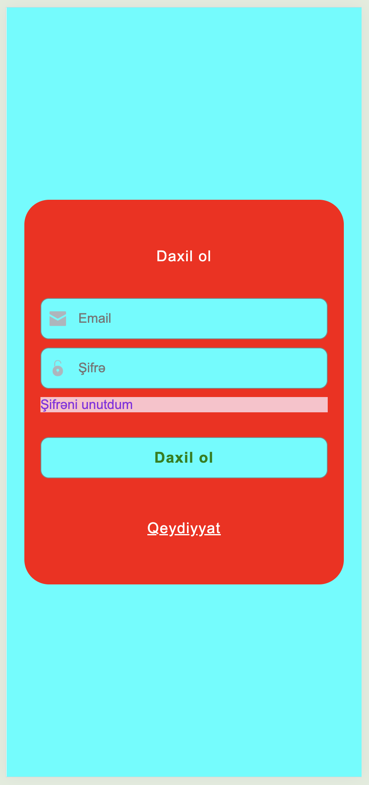
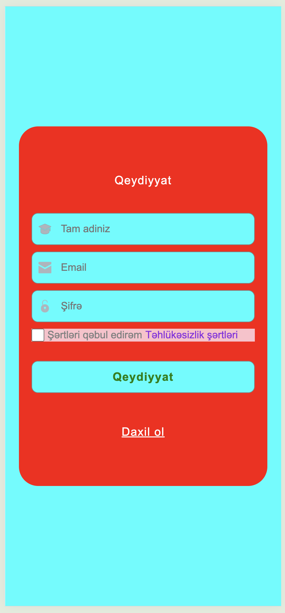
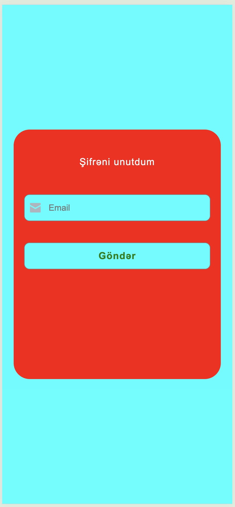
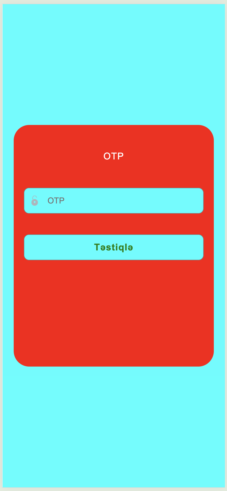
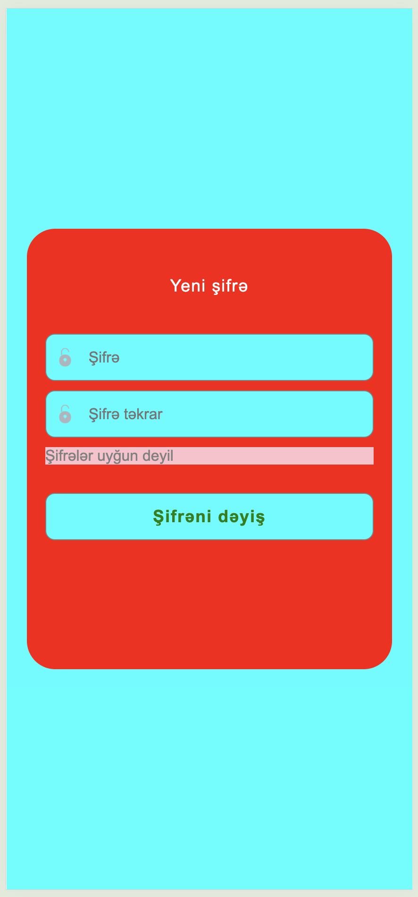
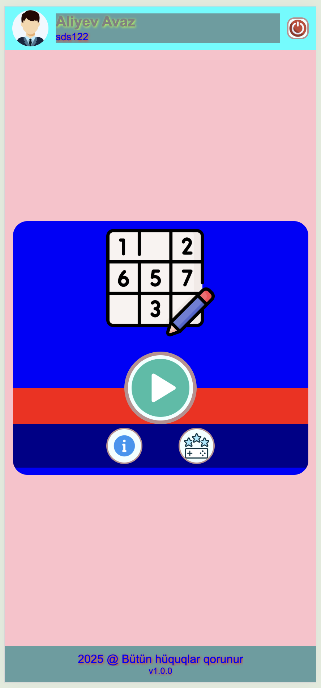
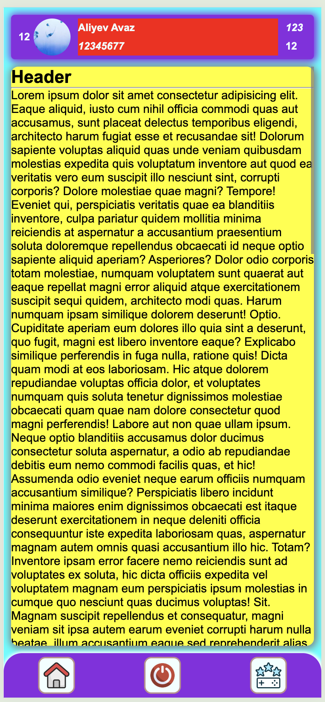
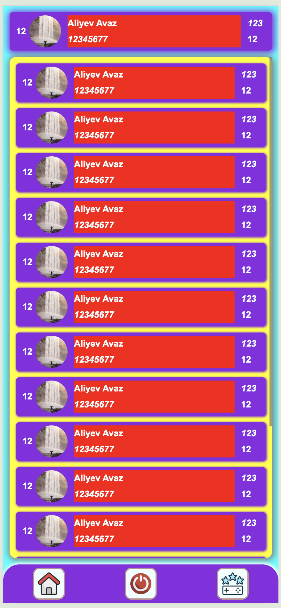
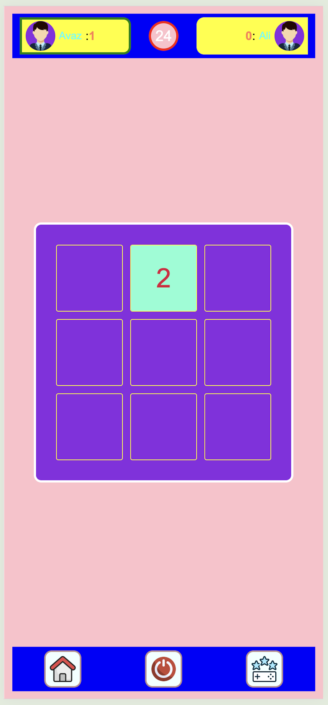

# Show Numbers Game

**Show Numbers Game** — yaddaş və diqqəti inkişaf etdirməyə yönəlmiş sadə və əyləncəli bir oyun layihəsidir.

---

## Layihə haqqında

HTML, CSS və JavaScript istifadə edərək sıfırdan hazırladığım 3x3 damalı interaktiv zəka oyunu. Oyun iki istifadəçi arasında keçirilir və məqsəd 1-dən 9-a qədər olan rəqəmləri düzgün ardıcıllıqla tapmaqdır.

✨ Oyun səhifəsində aşağıdakı funksiyalar mövcuddur:

🔐 Daxil ol və qeydiyyat sistemləri – istifadəçilərin öz hesabları ilə giriş etməsi üçün

ℹ️ Haqqımızda bölməsi – layihə və müəllif barədə məlumat verilir

🏆 Reytinq cədvəli – istifadəçilərin topladığı xalların sıralanması

🎯 Oyunun əsas məntiqi və növbəlilik sistemi – oyunçular səhv etdikdə və ya vaxt bitdikdə növbə dəyişir


## 🛠️ İstifadə olunan texnologiyalar və onların rolu:

- HTML (HyperText Markup Language) – səhifənin strukturunu və əsas bölmələrini yaratmaq üçün istifadə olunub. Məsələn: login formaları, oyun taxtası (grid), düymələr və s.

- CSS (Cascading Style Sheets) – oyunun vizual görünüşünü formalaşdırmaq üçün istifadə olunub. Məsələn: düymələrin rəngi, animasiyalar, responsiv dizayn.
  
- JavaScript – oyunun əsas məntiqini, istifadəçi qarşılıqlı əlaqəsini və növbəlilik mexanizmini həyata keçirmək üçün istifadə olunub. Məsələn: təsadüfi rəqəmlərin yerləşdirilməsi, düymələrin klikləri, vaxt sayğacı və oyunçu dəyişməsi.  

Tamamilə ön yüz (frontend) texnologiyaları əsasında hazırlanıb və brauzerdə işləyir.

## Necə işlətmək olar?

1. Repo klonlayın:
   ```bash
   git clone https://github.com/avazalijamal/Show-Numbers-Game.git
   ```
2. Layihə qovluğuna daxil olun:
   ```bash
   cd Show-Numbers-Game
   ```
3. `index.html` faylını brauzerdə açın və oyuna başlayın.

## Ekran Görüntüləri

Aşağıda oyunun bəzi ekran görüntülərini görə bilərsiniz:

  
*Oyunun Daxil ol ekranı*

  
*Oyunda Qeydiyyat ekranı*

  
*Oyunu Şifrəni unutdum ekranı*

  
*Oyunda OTP kod ekranı*

  
*Oyunun Şifrəni yenilə ekranı*

  
*Oyunu Ana ekranı*

  
*Oyunun Haqqında ekranı*

  
*Oyunda Reyting ekranı*

  
*Oyunu Oyun ekranı*

> **Qeyd:** Əgər layihənizdə `screenshots` qovluğu və ya şəkillər yoxdursa, öz ekran görüntülərinizi `screenshots` adlı qovluğa əlavə edib linkləri uyğun şəkildə dəyişdirin.

## Video dərslər

Layihənin hazırlanma mərhələləri və izahlı video dərslər üçün YouTube playlistinə baxa bilərsiniz:  
[](https://www.youtube.com/playlist?list=PLOzBGJnzBwOHrjZ3mgDBfAWJ3lhzN7nxq)

## Əlaqə və dəstək

Layihə ilə bağlı hər hansı sualınız, təklifiniz və ya problem yaranarsa, [GitHub Issues](https://github.com/avazalijamal/Show-Numbers-Game/issues) bölməsindən müraciət edə bilərsiniz.

---

## Müəllif

**Aliyev Avaz**  
GitHub: [avazalijamal](https://github.com/avazalijamal)

---

Oyundan zövq alın və yaddaşınızı gücləndirin!
